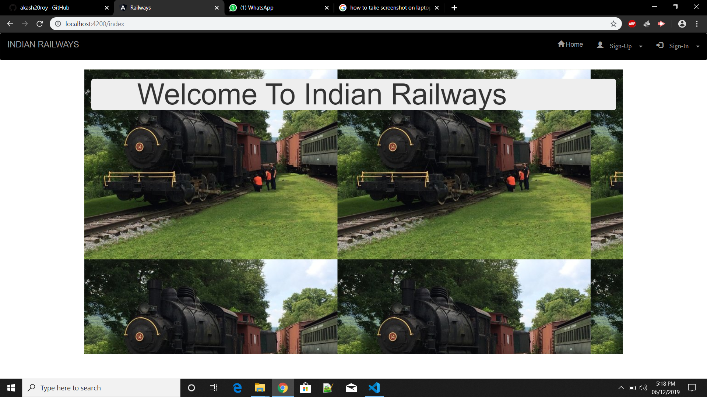
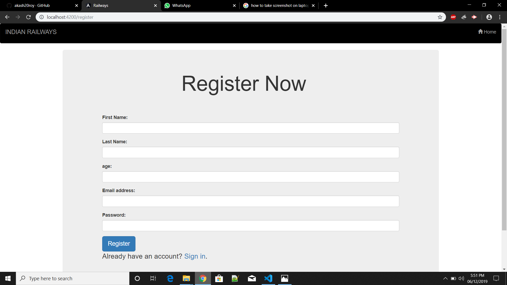
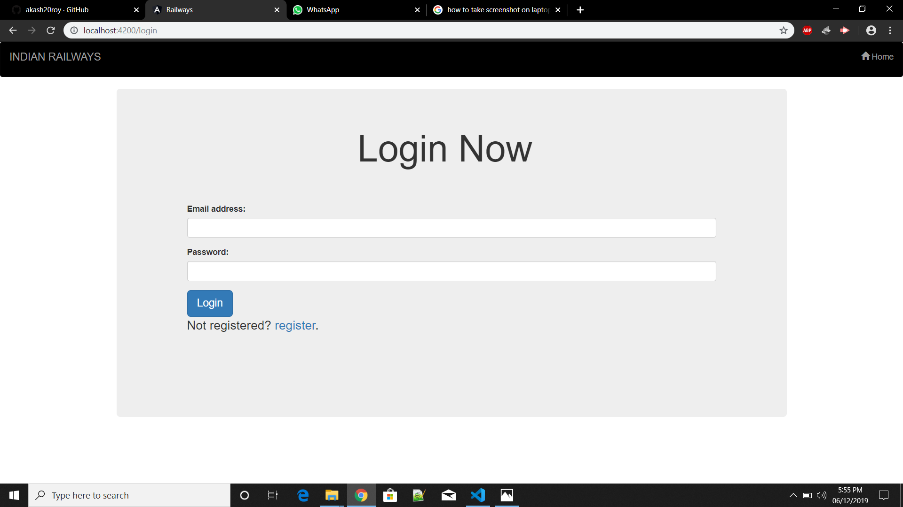
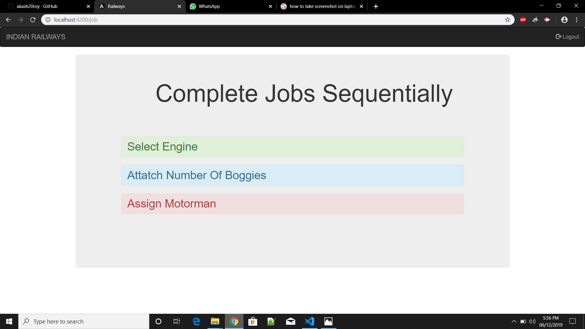
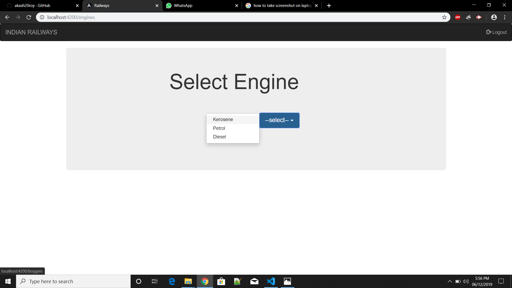
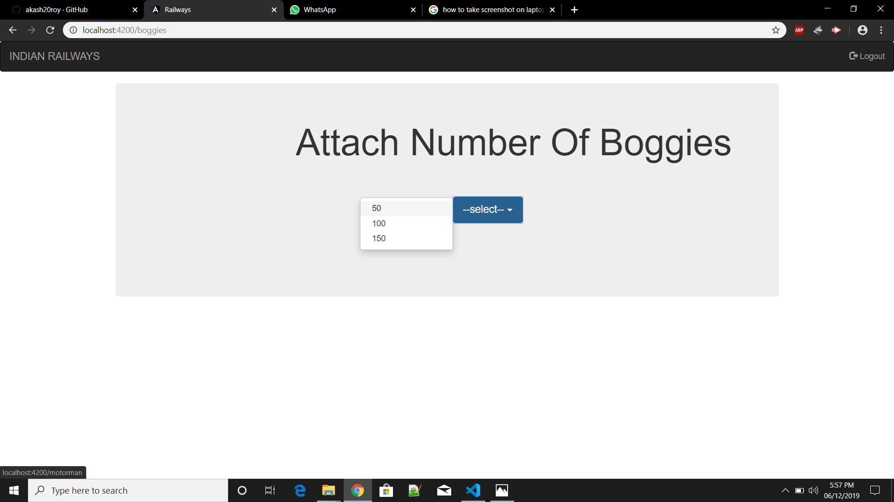
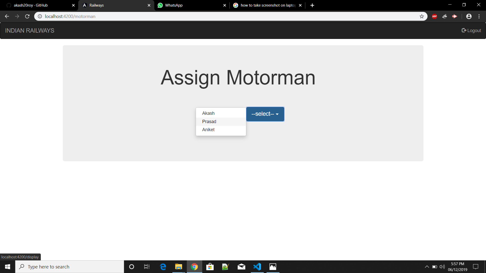
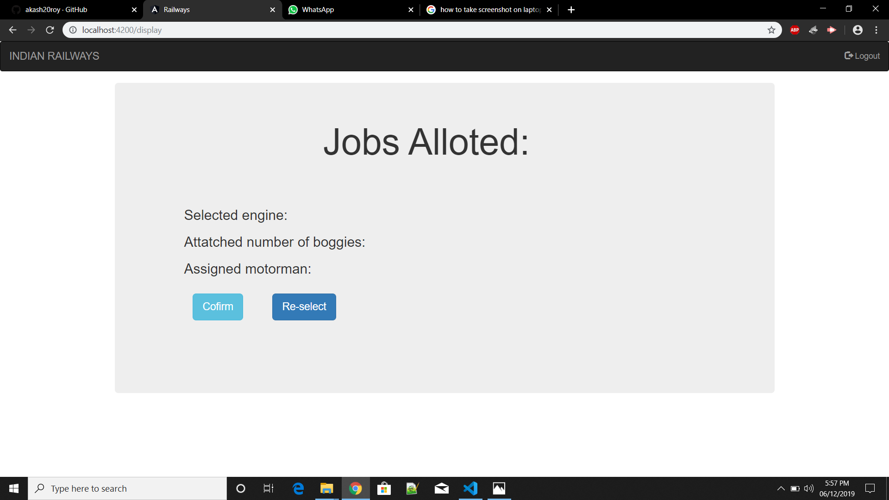
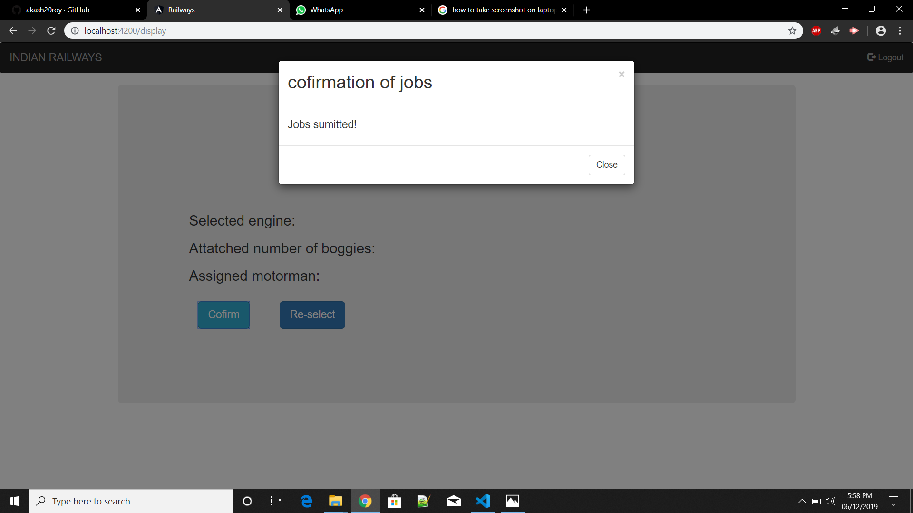

# railway management system
  It is an online railway website which can be controlled from the admin side to serve the facilities for passengers as well as the controller of the train.
  
  Screenshots of the Project:
  
  
  

  
    
  
  
  

  

  

  

  

  
  
  

